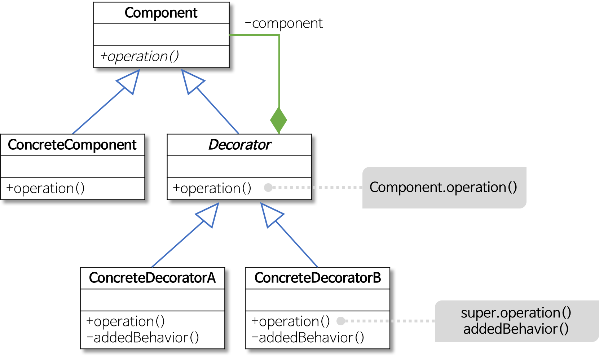

# Decorator Pattern

> SOLID 중에서 OCP와 DIP를 따른다. 

- 데코레이터 패턴은 기본 객체에
  추가적인 기능을 동적으로 유연하게 첨가하는 패턴이다.

- 객체에 추가적인 요건을 동적으로 첨가하며, 기능 확장이 필요할 때 서브클래싱 대신 쓸 수 있는 유연한 대안이 될 수 있다.

　
　

　

- #### Component
    - `ConcreteComponent` 와 `Decorator` 가 구현할 인터페이스다. 
    - 두 객체를 동등하게 다루기 위해 존재함

- #### ConcreteComponent
    - Decorate 를 받을 객체다.
    - 즉, 기능 추가를 받을 기본 객체

- #### Decorator
    - Decorate 를 할 객체의 추상 클래스다.
    - 즉, 기능 추가를 할 객체는 이 객체를 상속받는다.

- #### ConcreteDecorator
    - `Decorator` 를 상속받아 구현할 다양한 기능 객체이다.
    - 이 기능들은 `ConcreteComponent`에 추가되기 위해 만들어 진다.

　

- `ConcreteComponent`에 새로운 행동을 동적으로 추가할수 있다.

- 각 데코레이터 안에는 구성요소(Component)에 대란 레퍼런스가 들어있는 인스턴스 변수가있다.

- `Decorator`는 자신이 장식할 구성요소(Component)와 같은 인터페이스 또는 추상 클래스를 구현한다.

- `ConcreteDecoratorA`, `ConcreteDecoratorB`에는 그 객체가 장식하고있는(데코레이터가 감싸고 있는 Component객체)을 위한 인스턴스 변수가 있다. 따라서 데코레이터는 Component의 상태를 확장할 수 있다.

- `ConcreteDecoratorA`, `ConcreteDecoratorB` 데코레이터에서 새로운 메소드를 추가할 수도 있다. 하지만 일반적으로 새로운 메소드를 추가하는 대신 Component에 원래 있던 메소드를 호출하기 전, 또는 후에 별도의 작업을 처리하는 방식으로 새로운 기능을 추가한다.

