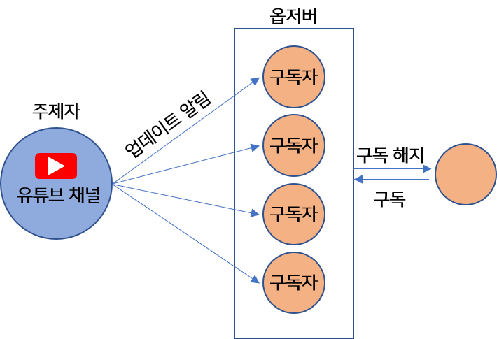
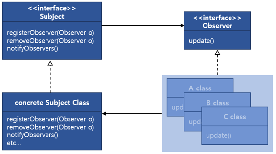

# Observer Pattern

>**Head First Design Pattern**<br/>
>한 객체의 상태가 바뀌면 그 객체에 의존하는 다른 객체들에게 정보가 자동으로 갱신되는 방식으로, 일대다(one-to-many) 의존성을 정의합니다.

옵저버 패턴은 관찰자 패턴이라고도 합니다.
일대다 관계를 이루고 있으며, 상태가 업데이트되면 모든 옵저버들에게 정보를 갱신할 수 있도록 하는 것을 의미합니다


### 예시 ) 유튜브 구독 알람

철수(Observer)가 코딩 공부를 위해 유튜브에서 프로그래밍 관련 영상을 찾고 있습니다. 
그런데 Luckygg(Subject)라는 사람의 채널에 좋은 영상들이 있는 것을 알게 됐습니다. 
하나 둘 개제 된 영상들을 보게 되다가 어느새 모든 영상들을 보게 됐습니다. 
이제 새로운 영상이 업데이트되는 것을 기다리고 있습니다. 그런데 이 영상이 언제 올라올 줄 알고 마냥 기다릴까요? 
이때, 채널 구독(Register)을 하여 업데이트 알림(Notify)을 받게 하는 방법이 있습니다. 
유튜브 채널 관리자가 영상을 업데이트하면, 구독하고 있는 모든 사용자들에게 알림을 전달하는 것입니다.



특정 정보를 여러 뷰에서 동시에 얻기 위해 
주제자(Subject)에 구독자(Observer)를 등록(Register)하여 정보를 받는(갱신, Notify) 것을 옵저버 패턴(Observer pattern)이라고 합니다. 
물론 등록을 했으니 해지(Remove)도 가능합니다.

옵저버 패턴에서 주제자는 옵저버에 대한 정보가 없습니다. 오직 옵저버가 `특정 인터페이스(Interface)`를 `구현`한다는 것 만 알고 있습니다. 즉, `옵저버가 무슨 동작을 하는지 모른다는` 것입니다. 게다가 옵저버는 `언제든지 새로 추가되거나 제거`될 수 있으며 새로운 형식의 옵저버를 추가할 때에도 `주제에 전혀 영향을 주지 않습니다`. 이러한 관계를 `느슨한 결합(Loose coupling)`이라고 합니다.

　




`Subject interface`는 `등록`, `해제`, `갱신`을 위한 API를 제공합니다. 
그리고 이를 상속받는 `concrete Subject Class`는 `등록`, `해제`, `갱신`을 구현하고 `기타 함수도 구현할 수 있습니다`. 
Observer interface는 Subject에서 갱신할 때 호출되는 update API만 제공합니다. 
마지막으로 Observer interface를 상속받는 A, B, C Class에 update를 구현합니다. 이것이 옵저버 패턴의 가장 기본적인 구조입니다.

　

　

### 코드 예제

>Concrete Subject class에서 값을 변경하면 등록된 모든 Observer들에게 갱신하는 간단한 구조입니다.


　

　


`Subject interface`입니다. Observer를 등록, 해제, 갱신하기 위한 API를 나타냅니다.
```java
public interface ISubject {

    //등록
    void registerObserver(IObserver observer);

    //해제
    void removeObserver(IObserver observer);

    //갱신
    void notifyObserver();
}
```


`Observer interface`입니다.
```java
public interface IObserver {
    void update();
}
```


`ConcreteSubject는` Subject interface를 상속받습니다. 그리고 ArrayList를 사용하여 observer 정보를 가지고 있습니다.
```java
public class ConcreteSubject implements ISubject {

    private List<IObserver> observers;

    public ConcreteSubject() {
        observers = new ArrayList<IObserver>();
    }

    @Override
    public void registerObserver(IObserver observer) {
        observers.add(observer);
    }

    @Override
    public void removeObserver(IObserver observer) {
        observers.remove(observers.indexOf(observer));
    }

    @Override
    public void notifyObserver() {
        observers.stream().forEach(observer -> {
            observer.update();
        });
    }
}
```


아래는 각 Observer interface를 상속받는 A, B, C class입니다. 똑같은 클래스가 중복된 것입니다. 각 클래스 생성자에서 ConcreteSubject를 인자로 받고, registerObserver를 호출하여 자신을 옵저버로서 등록합니다.
```java
public class AClazz implements IObserver {

    private String name;

    public AClazz(String name) {
        this.name = name;
    }

    @Override
    public void update() {
        System.out.println(this.name + " 업데이트");
    }
}

public class BClazz implements IObserver{

    private String name;

    public BClazz(String name) {
        this.name = name;
    }

    @Override
    public void update() {
        System.out.println(this.name + " 업데이트");
    }
}

public class CClazz implements IObserver{

    private String name;

    public CClazz(String name) {
        this.name = name;
    }

    @Override
    public void update() {
        System.out.println(this.name + " 업데이트");
    }
}
```


이제 메인 프로그램 입니다. ConcreteSubject 및 A, B, C 인스턴스를 생성하는데 A, B, C 각 인스턴스가 옵저버로서 ConcreteSubject 인스턴스에 등록됩니다. 마지막 줄인 setValue(10)을 호출하면 모든 옵저버의 update가 호출됩니다.

```java

import dp.update.*;

public class Main {

    public static void main(String[] args) {

        ISubject subject = new ConcreteSubject();

        AClazz a = new AClazz("A 구독자");
        BClazz b = new BClazz("B 구독자");
        CClazz c = new CClazz("C 구독자");

        subject.registerObserver(a);
        subject.registerObserver(b);
        subject.registerObserver(c);

        System.out.println("1차 업데이트");
        subject.notifyObserver(); // a, b, c 구독자 업데이트
        System.out.println("--------------------");

        System.out.println("C 구독자 제거");
        subject.removeObserver(c); // c 구독자 제거
        System.out.println("--------------------");

        System.out.println("2차 업데이트");
        subject.notifyObserver(); // a, b 구독자 업데이트
        System.out.println("--------------------");
    }
}

```
```
1차 업데이트
A 구독자 업데이트
B 구독자 업데이트
C 구독자 업데이트
--------------------
C 구독자 제거
--------------------
2차 업데이트
A 구독자 업데이트
B 구독자 업데이트
--------------------
```


## Reference :pushpin:

- [https://ko.wikipedia.org/wiki/옵서버_패턴](https://ko.wikipedia.org/wiki/%EC%98%B5%EC%84%9C%EB%B2%84_%ED%8C%A8%ED%84%B4)
- https://johngrib.github.io/wiki/observer-pattern/
- https://luckygg.tistory.com/181
- [https://velog.io/@hanna2100/observer-pattern](https://velog.io/@hanna2100/%EB%94%94%EC%9E%90%EC%9D%B8%ED%8C%A8%ED%84%B4-2.-%EC%98%B5%EC%A0%80%EB%B2%84-%ED%8C%A8%ED%84%B4-%EA%B0%9C%EB%85%90%EA%B3%BC-%EC%98%88%EC%A0%9C-observer-pattern)
