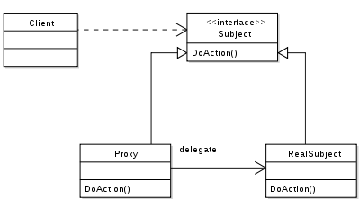

# Proxy Pattern?

> OCP, DIP 설계 원칙
 

실제 기능을 수행하는 객체`Real Object` 대신 가상의 객체`Proxy Object`를 사용해 로직의 흐름을 제어하는 디자인 패턴입니다.

- 어떤 객체를 사용하고자 할때, 객체를 직접적으로 참조 하는것이 아니라, 해당 객체를 대행(대리, proxy)하는 객체를 통해 대상객체에 접근하는 방식을 사용하면 해당 객체가 메모리에 존재하지 않아도 기본적인 정보를 참조하거나 설정할 수 있고 또한 실제 객체의 기능이 반드시 필요한 시점까지 객체의 생성을 미룰 수 있습니다.

- 예를 들어 용량이 큰 이미지와 글이 같이 있는 문서를 모니터 화면에 띄운다고 가정하였을때 이미지 파일은 용량이 크고 텍스트는 용량이 작아서 텍스트는 빠르게 나타나지만 그림은 조금 느리게 로딩되는 것을 보신적이 있으실겁니다. 만약 이렇게 처리가 안되고 이미지와 텍스트가 모두 로딩이 된 후에야 화면이 나온다면 사용자는 페이지가 로딩될때까지 의미없이 기다려야 합니다. 그러므로 먼저 로딩이 되는 텍스트라도 먼저 나오는게 좋습니다. 이런 방식을 취하려면 텍스트 처리용 프로세서, 그림 처리용 프로세스를 별도로 운영하면 됩니다. 이런 구조를 갖도록 설계하는것이 바로 프록시 패턴입니다. 일반적으로 프록시는 다른 무언가와 이어지는 인터페이스의 역할을 하는 클래스를 의미합니다.

　

>Real Object, Proxy Object는 동일한 인터페이스를 구현합니다.  
>Proxy Object는 메서드 수행시 실제 객체(Real Object)의 메서드에 위임합니다.

>Client -> Proxy -> RealSubject

### 구조
- Subject
    - Proxy 와 RealSubject 가 구현해야하는 인터페이스
    - 두 객체를 동일하게 다루기 위해 존재
- Proxy
    - RealSubect 와 Client 요청 사이에 존재하는 객체
    - Subject 를 구현함으로써 클라이언트는 RealSubject 사용하는 것과 별 차이가 없어야 한다.
- RealSubject
    - 실질적으로 요청에 대해 주된 기능을 수행하는 객체
    - Proxy 객체는 내부적으로 이 객체를 로직에 맞게 사용한다. (위임)

　

### 프록시 패턴 특징

- 원래 하려던 기능을 수행하며 그외의 부가적인 작업(로깅, 인증, 네트워크 통신 등)을 수행하기에 좋습니다.
- 비용이 많이 드는 연산(DB 쿼리, 대용량 텍스트 파일 등)을 실제로 필요한 시점에 수행할 수 있습니다.
- 사용자 입장에서는 프록시 객체나 실제 객체나 사용법은 유사하므로 사용성이 좋습니다.

　
### 장점 
- 기본 객체의 리소스가 무거운 경우, 프록시 객체에서 간단한 처리를 하거나 기본 객체를 캐싱 처리함으로써 부하를 줄일 수 있다.
- 기본 객체에 대한 수정 없이, 클라이언트에서의 사용과 기본 객체 사이에 일련의 로직을 프록시 객체를 통해 넣을 수 있다.
- 프록시는 기본 객체와 요청 사이에 있기 때문에, 일종의 방패(보안)의 역할도 한다.
- 구조나 코드 구현이 간단함.

### 단점
- 프록시 객체가 중간에 껴있기 때문에, 간혹 응답이 느려질 수 있다. (캐싱이 안되어있는 초기 사용의 경우)

　

## 프록시가 사용되는 대표적인 3가지 

### 가상_프록시(Virtual_Proxy)

꼭 필요로 하는 시점까지 객체의 생성을 연기하고, <mark>해당 객체가 생성된 것처럼 동작하도록 만들고 싶을때</mark> 사용하는 패턴입니다. 프록시 클래스에서 자잘한 작업들을 처리하고 리소스가 많이 요구되는 작업들이 필요할 때에만 주체 클래스를 사용하도록 구현하며 위에서 예로 들었다시피 해상도가 아주 높은 이미지를 처리해야 하는 경우 작업을 분산하는것을 예로 들 수 있겠습니다.

### 원격프록시(Remote Proxy)
원격 객체에 대한 접근을 제어 로컬 환경에 존재하며, 원격객체에 대한 대변자 역할을 하는 객체 <mark>서로다른 주소 공간에 있는 객체에 대해</mark> 마치 같은 주소 공간에 있는 것처럼 동작하게 만드는 패턴입니다. 예시로 Google Docs를 들 수 있겠습니다. 브라우저는 브라우저대로 필요한 자원을 로컬에 가지고 있고 또다른 자원은 Google 서버에 있는 형태입니다.

### 보호프록시(Protection Proxy)
<mark>주체 클래스에 대한 접근을 제어</mark>하기 위한 경우에 객체에 대한 접근 권한을 제어하거나 객체마다 접근 권한을 달리하고 싶을때 사용하는 패턴으로 프록시 클래스에서 클라이언트가 주체 클래스에 대한 접근을 허용할지 말지 결정하도록 할수가 있습니다.