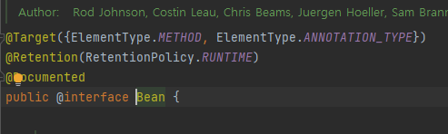
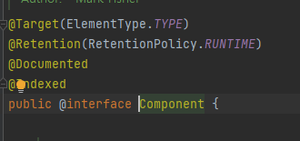

## **@Bean vs @Component**


### **@Bean 과 @Component 사용하는 이유?**

IoC Container는 @Configuration, @Bean, @Component, @Repository, @Service, @Controller가 달린 클래스를

감지하며 빈을 가져오기 위해 빈 스캐닝을 합니다.

대표적으로 빈으로 사용 할 수 있도록 해주는 어노테이션으로

**@Bean**과 **@Component**이 있다.

(@Configuration은 구성클래스를 만들 때 사용, @Repository, @Service, @Controller는 @Component에 속해있다.)


### **👉 @Bean**

- @Bean은 개발자가 직접 제어가 불가능한 외부 라이브러리를 사용할 때 사용한다.
- @Configuration을 선언한 클래스 내부에서 사용해준다.
- 즉, 개발자가 작성한 **메소드**를 통해 반환되는 객체를 Bean으로 만든다.

- 예를 들면 ObjectMapper의 경우 ObjectMapper Class에 @Component를 선언할수는 없으니 ObjectMapper의 인스턴스를 생성하는 메소드를 만들고 해당 메소드에 @Bean을 선언하여 Bean으로 등록한다.


< 개발자가 직접 제어가 불가능한 외부 라이브러리를 사용한 경우 >

```
@ConfigurationpublicclassExampleConfig {

@Beanpublic ArrayList<String>array(){
returnnew ArrayList<String>();
    }
}
```

< 개발자가 만들어준 클래스를 import해 사용한 경우 >

```
@ConfigurationpublicclassExampleConfig {

@Bean(name="mybean")
public Productaaa(){
          Battery p1 =new Battery("AAA", 2.5);
          p1.setRechargeable(true);
return p1;
   	}
}
```

- name 속성을 주지 않으면 자동으로 빈의 이름(Bean id)으로 'aaa'가 생성된다(대문자 없애고 소문자로만.)
- name 속성을 주면 자동으로 빈의 이름(Bean id)으로 2번째 예시와 같이 'mybean'이 생성된다.

### **👉 @Component**

- @Component는 개발자가 직접 작성한 **Class**를 Bean으로 등록 할 수 있게 만들어 준다.
- 즉 개발자가 작성한 class를 Bean으로 만든다.

```
@Component(value="mybean")
publicclassExample {
	puiblicExample(){
    	System.out.println("Hello world");
    }
}
```

- Bean id를 지정해줄 때는 name 속성이 아닌 value 속성을 사용해 Bean id를 지정해준다.

　


***
　


> 개발자가 생성한 Class에 @Bean은 선언이 불가능


**@Bean과 @Component는 각자 선언할 수 있는 타입이 정해져있어** 해당 용도외에는 컴파일 에러를 발생시킨다.



@Target이 METHOD로 지정되어 있지만, TYPE은 없다




@Target이 TYPE로 지정되어 Class위에서만 선언될수 있음을 알수 있다.


