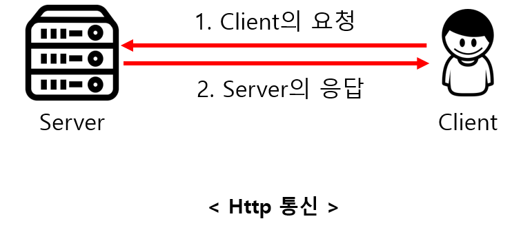

# HTTP Protocol

- HTTP (Hyper Text Transfer Protocol)로 RFC 2616에서 규정된 Web에서 데이터를 주고 받는 프로토콜.
- TCP를 기반으로 한 REST의 특징을 모두 구현하고 있는 Web기반의 프로토콜


### HTTP 통신 방법

- HTTP는 메시지를 주고(Request) 받는 (Response) 형태의 통신방법.




　

　


## HTTP Method


### GET  
- 리소스의 조회에 사용한다.

- 서버에 전달하고 싶은 데이터를 query(parameter, query string)을 통해 전달한다.

- 메시지 바디를 통해 데이터를 전달할 수도 있지만 지원하지 않는 곳도 존재하기 때문에 권장❌


### POST
- 메시지 바디를 통해 서버로 요청 데이터를 전달한다. 서버는 메시지 바디를 통해 들어온 데이터를 처리하는 모든 기능을 수행한다.

- 주로 신규 리소스의 등록, 프로세스 처리 등에 사용한다

- 신규 리소스를 등록했다면 새로 생성되었다는 201 상태 코드와 생성된 URI 경로(Location)를 반환한다
- 또한, 다른 메소드로 처리하기 애매한 경우 주로 사용된다. 조회할 때 데이터를 넘기기 어려운 경우 데이터를 넘기는 데 사용할 수 있지만 조회는 GET을 사용하는 것이 좋다! POST는 캐싱하기 어렵기 때문...


### PUT
- 목적 리소스를 현재 메시지의 값으로 생성하거나 만약 존재한다면 기존 리소스를 삭제하고 덮어쓰기 한다.


```
💡 POST와 PUT은 어떻게 구분해서 사용할까?

PUT은 POST와 다르게 클라이언트가 리소스의 위치를 알고 URI를 지정해 주어야 한다!
ex) PUT /members/100
```

### PATCH
- 리소스를 부분적으로 변경한다.

- 지원하지 않는 경우도 있어 이런 경우 POST로 대체하여 사용


###  DELETE
특정 리소스의 삭제를 요청하는 데 사용


### 기타 메소드
잘 사용되지 않는 메소드들

- HEAD : GET과 동일하지만 메시지 바디를 제외하고 반환
- OPTIONS : 대상 리소스에 대한 통신을 설정하는 데 사용
- CONNECT : 대상 자원으로 식별되는 서버에 대한 터널을 설정
- TRACE : 대상 리소스에 대한 경로를 따라 메시지 루프백 테스트를 수행


## HTTP 메소드의 속성

### 안전 Safe
호출해도 리소스를 변경하지 않는 특성

### 멱등성 Idempotent
- 동일한 요청을 여러 번 보내도 한 번 보내는 것과 같은 것

- 외부 요인으로 중간에 리소스가 변경되는 것을 고려하지 않고 해당 요청을 기준으로 고려한다

- 올바르게 구현한 GET, PUT, DELETE 메소드는 멱등성을 지녀야 한다.

예)

DELETE /members/100 → 200  
DELETE /members/100 → 404  
DELETE를 여러 번 호출하면 응답 코드는 달라질 수 있지만, 100번 member가 삭제된 것은 동일

### 캐시 가능 Cacheable
- 응답 결과를 서버에 캐시 해서 사용해도 되는 메소드

- GET, HEAD, POST, PATCH가 가능하지만 실무에서는 구현이 어렵기 때문에 GET, HEAD 정도만 캐시 하여 사용


## HTTP 응답 상태 코드
|상태코드|큰 의미|
|-----|------|
|1xx|처리중|
|2xx|성공|
|3xx|리다이렉트|
|4xx|클라이언트 에러|
|5xx|서버에러|

|상태코드|결과|
|-----|------|
|200|클라이언트의 요청을 정상적으로 수행함|
|201|클라이언트가 어떠한 리소스 생성을 요청 <br/>해당 리소스가 성공적으로 생성됨(POST를 통한 리소스 생성 작업 시)|
|301|리소스가 다른 장소로 변경됨을 알림|
|303|Client에서 자동으로 새로운 리소스로 요청 처리|
|400|클라이언트의 요청이 부적절 할 경우 사용하는 응답 코드|
|401|(권한 없음, 인증 실패)클라이언트가 인증되지 않은 상태에서 보호된 리소스를 요청했을 때 사용하는 응답 코드|
|403|유저 인증상태와 관계 없이 응답하고 싶지 않은 리소스를 클라이언트가 요청했을 때 사용하는 응답 코드<br/>(403 보다는 400이나 404를 사용할 것을 권고. 403 자체가 리소스가 존재한다는 뜻이기 때문에)|
|405|클라이언트가 요청한 리소스에서는 사용 불가능한 Method를 이용했을 경우 사용하는 응답 코드|
|301|클라이언트가 요청한 리소스에 대한 URI가 변경 되었을 때 사용하는 응답 코드<br/>(응답 시 Location header에 변경된 URI를 적어 줘야 합니다.)|
|500|서버에 문제가 있을 경우 사용하는 응답 코드|
|503|서비스 정지 (점검 등등...)|

　


## Reference :pushpin:

- https://ko.wikipedia.org/wiki/REST  
- http://blog.remotty.com/blog/2014/01/28/lets-study-rest/  
- https://yangbongsoo.gitbooks.io/study/content/restc758_c774_d574_c640_c124_acc4.html
- https://girawhale.tistory.com/66
- https://meetup.toast.com/posts/92
- http://spoqa.github.io/2012/02/27/rest-introduction.html